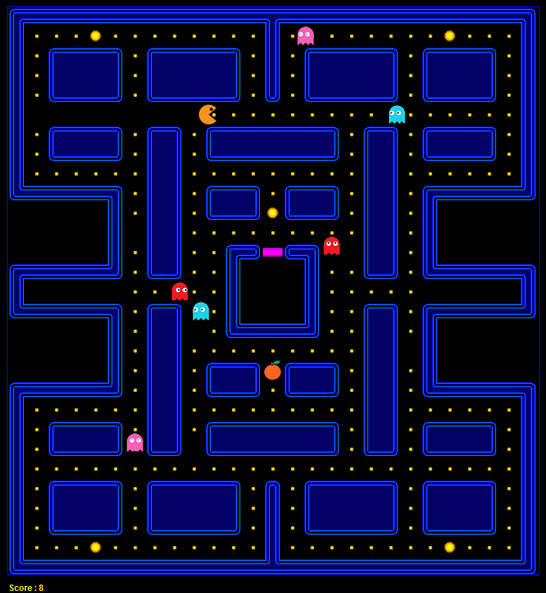

# Pacman

This project was originally developed by @arminkz under the GPL3 license.

It has been forked and updated by the course staff of ECE 461 (Software Engineering) at Purdue
and is to be used for refactoring exercises in the course.

A simple java game using the following java libraries:
1. Swing
2. Map Editor 
3. Map Compiler

